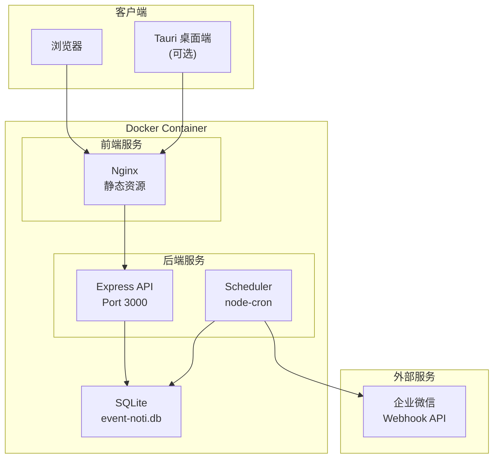
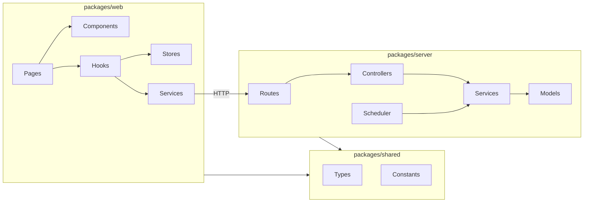

# Design Document - EventNoti

## Overview

EventNoti 采用前后端分离的 Web 应用架构。前端使用 React + Vite 构建 SPA 应用，后端使用 Node.js + Express 提供 RESTful API，数据存储使用 SQLite，定时任务使用 node-cron 调度。整体通过 Docker 容器化部署。

## Steering Document Alignment

### Technical Standards (tech.md)
- 前端：Vite + React + TypeScript + Tailwind CSS + Lucide React
- 后端：Node.js + Express + TypeScript
- 数据库：SQLite + better-sqlite3
- 状态管理：Zustand + React Query
- 定时任务：node-cron

### Project Structure (structure.md)
- pnpm monorepo 结构：packages/web、packages/server、packages/shared
- 前后端共享类型定义
- RESTful API 规范

---

## Architecture

### System Architecture



### Module Architecture



---

## Components and Interfaces

### Frontend Components

#### Pages
| Component | Purpose | Route |
|-----------|---------|-------|
| `LoginPage` | 用户登录 | `/login` |
| `DashboardPage` | 首页概览 | `/` |
| `EventListPage` | 事件列表 | `/events` |
| `EventFormPage` | 事件创建/编辑 | `/events/new`, `/events/:id/edit` |
| `GroupListPage` | 分组管理 | `/groups` |
| `WebhookListPage` | Webhook 管理（管理员） | `/admin/webhooks` |
| `UserListPage` | 用户管理（管理员） | `/admin/users` |
| `NotificationHistoryPage` | 通知历史 | `/notifications` |

#### UI Components
| Component | Purpose |
|-----------|---------|
| `Button` | 通用按钮 |
| `Input` | 输入框 |
| `Select` | 下拉选择 |
| `DatePicker` | 日期选择器 |
| `Modal` | 模态框 |
| `Toast` | 消息提示 |
| `Card` | 卡片容器 |
| `Table` | 数据表格 |
| `Badge` | 标签徽章 |
| `Sidebar` | 侧边栏导航 |

#### Business Components
| Component | Purpose |
|-----------|---------|
| `EventCard` | 事件卡片展示 |
| `EventForm` | 事件表单 |
| `GroupTag` | 分组标签 |
| `CountdownBadge` | 倒计时徽章 |
| `NotificationItem` | 通知历史条目 |
| `WebhookTestButton` | Webhook 测试按钮 |

### Backend Services

#### Controllers
| Controller | Purpose | Requirements |
|------------|---------|--------------|
| `AuthController` | 处理认证请求 | REQ-1 |
| `UserController` | 用户 CRUD | REQ-1 |
| `EventController` | 事件 CRUD | REQ-2 |
| `GroupController` | 分组 CRUD | REQ-3 |
| `WebhookController` | Webhook CRUD | REQ-4 |
| `NotificationController` | 通知历史查询 | REQ-5, REQ-6 |

#### Services
| Service | Purpose | Dependencies |
|---------|---------|--------------|
| `AuthService` | 认证逻辑 | UserModel, JWT |
| `UserService` | 用户业务逻辑 | UserModel |
| `EventService` | 事件业务逻辑 | EventModel, NotificationService |
| `GroupService` | 分组业务逻辑 | GroupModel |
| `WebhookService` | Webhook 管理 | WebhookModel, axios |
| `NotificationService` | 通知发送逻辑 | NotificationModel, WebhookService |
| `SchedulerService` | 定时任务调度 | NotificationService, node-cron |

---

## Data Models

### Database Schema

```sql
-- 用户表
CREATE TABLE users (
    id INTEGER PRIMARY KEY AUTOINCREMENT,
    username TEXT UNIQUE NOT NULL,
    password_hash TEXT NOT NULL,
    display_name TEXT NOT NULL,
    role TEXT DEFAULT 'user' CHECK(role IN ('admin', 'user')),
    is_active INTEGER DEFAULT 1,
    created_at DATETIME DEFAULT CURRENT_TIMESTAMP,
    updated_at DATETIME DEFAULT CURRENT_TIMESTAMP
);

-- Webhook 配置表
CREATE TABLE webhooks (
    id INTEGER PRIMARY KEY AUTOINCREMENT,
    name TEXT NOT NULL,
    url TEXT NOT NULL,
    is_default INTEGER DEFAULT 0,
    created_by INTEGER REFERENCES users(id),
    created_at DATETIME DEFAULT CURRENT_TIMESTAMP,
    updated_at DATETIME DEFAULT CURRENT_TIMESTAMP
);

-- 分组表
CREATE TABLE groups (
    id INTEGER PRIMARY KEY AUTOINCREMENT,
    name TEXT NOT NULL,
    color TEXT DEFAULT '#3B82F6',
    webhook_id INTEGER REFERENCES webhooks(id) ON DELETE SET NULL,
    user_id INTEGER NOT NULL REFERENCES users(id),
    created_at DATETIME DEFAULT CURRENT_TIMESTAMP,
    updated_at DATETIME DEFAULT CURRENT_TIMESTAMP
);

-- 事件表
CREATE TABLE events (
    id INTEGER PRIMARY KEY AUTOINCREMENT,
    title TEXT NOT NULL,
    content TEXT,
    target_date DATE NOT NULL,
    remind_days INTEGER DEFAULT 7,
    group_id INTEGER REFERENCES groups(id) ON DELETE SET NULL,
    user_id INTEGER NOT NULL REFERENCES users(id),
    status TEXT DEFAULT 'active' CHECK(status IN ('active', 'expired', 'completed')),
    created_at DATETIME DEFAULT CURRENT_TIMESTAMP,
    updated_at DATETIME DEFAULT CURRENT_TIMESTAMP
);

-- 通知记录表
CREATE TABLE notifications (
    id INTEGER PRIMARY KEY AUTOINCREMENT,
    event_id INTEGER NOT NULL REFERENCES events(id) ON DELETE CASCADE,
    scheduled_date DATE NOT NULL,
    sent_at DATETIME,
    status TEXT DEFAULT 'pending' CHECK(status IN ('pending', 'sent', 'failed')),
    error_message TEXT,
    retry_count INTEGER DEFAULT 0,
    created_at DATETIME DEFAULT CURRENT_TIMESTAMP
);

-- 索引
CREATE INDEX idx_events_user_id ON events(user_id);
CREATE INDEX idx_events_target_date ON events(target_date);
CREATE INDEX idx_notifications_scheduled_date ON notifications(scheduled_date);
CREATE INDEX idx_notifications_status ON notifications(status);
```

### TypeScript Types (shared)

```typescript
// packages/shared/src/types/user.ts
export interface User {
  id: number;
  username: string;
  displayName: string;
  role: 'admin' | 'user';
  isActive: boolean;
  createdAt: string;
}

// packages/shared/src/types/event.ts
export interface Event {
  id: number;
  title: string;
  content: string | null;
  targetDate: string; // YYYY-MM-DD
  remindDays: number;
  groupId: number | null;
  userId: number;
  status: 'active' | 'expired' | 'completed';
  createdAt: string;
  updatedAt: string;
  // 关联数据
  group?: Group;
  daysRemaining?: number;
}

// packages/shared/src/types/group.ts
export interface Group {
  id: number;
  name: string;
  color: string;
  webhookId: number | null;
  userId: number;
  webhook?: Webhook;
}

// packages/shared/src/types/webhook.ts
export interface Webhook {
  id: number;
  name: string;
  url: string;
  isDefault: boolean;
  createdBy: number;
}

// packages/shared/src/types/notification.ts
export interface Notification {
  id: number;
  eventId: number;
  scheduledDate: string;
  sentAt: string | null;
  status: 'pending' | 'sent' | 'failed';
  errorMessage: string | null;
  retryCount: number;
  // 关联数据
  event?: Event;
}
```

---

## API Design

### Authentication
```
POST /api/auth/login
  Request:  { username: string, password: string }
  Response: { token: string, user: User }

POST /api/auth/logout
  Response: { success: true }

GET /api/auth/me
  Response: { user: User }
```

### Users (Admin)
```
GET    /api/users           → User[]
POST   /api/users           → User
PUT    /api/users/:id       → User
DELETE /api/users/:id       → { success: true }
```

### Events
```
GET    /api/events          → Event[] (支持 ?groupId= 筛选)
POST   /api/events          → Event
GET    /api/events/:id      → Event
PUT    /api/events/:id      → Event
DELETE /api/events/:id      → { success: true }
```

### Groups
```
GET    /api/groups          → Group[]
POST   /api/groups          → Group
PUT    /api/groups/:id      → Group
DELETE /api/groups/:id      → { success: true }
```

### Webhooks (Admin)
```
GET    /api/webhooks        → Webhook[]
POST   /api/webhooks        → Webhook
PUT    /api/webhooks/:id    → Webhook
DELETE /api/webhooks/:id    → { success: true }
POST   /api/webhooks/:id/test → { success: boolean, message: string }
```

### Notifications
```
GET /api/notifications/history → Notification[] (支持分页 ?page=&limit=)
```

---

## Notification Logic

### 发送时间计算

```typescript
// 每日固定时间检查（默认 09:00）
function calculateNotificationDates(event: Event): Date[] {
  const dates: Date[] = [];
  const target = new Date(event.targetDate);

  // 从 targetDate - remindDays 到 targetDate
  for (let i = event.remindDays; i >= 0; i--) {
    const date = new Date(target);
    date.setDate(date.getDate() - i);
    dates.push(date);
  }

  return dates;
}
```

### 消息格式

```typescript
// 企业微信 Markdown 消息格式
function formatNotificationMessage(event: Event, daysRemaining: number): string {
  const urgency = daysRemaining <= 3 ? '🔴' : daysRemaining <= 7 ? '🟡' : '🟢';
  const dayText = daysRemaining === 0 ? '今天' :
                  daysRemaining < 0 ? `已过期 ${Math.abs(daysRemaining)} 天` :
                  `还有 ${daysRemaining} 天`;

  return {
    msgtype: 'markdown',
    markdown: {
      content: `${urgency} **${event.title}**\n> ${dayText}\n\n${event.content || ''}`
    }
  };
}
```

---

## Error Handling

### Error Scenarios

| Scenario | HTTP Status | Error Code | User Impact |
|----------|-------------|------------|-------------|
| 认证失败 | 401 | AUTH_FAILED | 显示「用户名或密码错误」|
| Token 过期 | 401 | TOKEN_EXPIRED | 跳转登录页 |
| 权限不足 | 403 | FORBIDDEN | 显示「无权限操作」|
| 资源不存在 | 404 | NOT_FOUND | 显示「资源不存在」|
| 参数错误 | 400 | VALIDATION_ERROR | 显示具体错误字段 |
| Webhook 发送失败 | - | WEBHOOK_FAILED | 记录日志，自动重试 |

### 统一响应格式

```typescript
// 成功响应
{ data: T, success: true }

// 错误响应
{ error: { code: string, message: string }, success: false }
```

---

## Testing Strategy

### Unit Testing
- 使用 Vitest 测试框架
- 测试 Services 层业务逻辑
- 测试工具函数
- 覆盖率目标 > 70%

### Integration Testing
- 测试 API 端点（使用 supertest）
- 测试数据库操作
- 测试认证流程

### End-to-End Testing
- 使用 Playwright 测试关键流程
- 用户登录流程
- 事件创建流程
- 通知发送流程（Mock Webhook）

---

## Security Considerations

1. **认证安全**：JWT Token 设置合理过期时间（7 天），HttpOnly Cookie 存储
2. **密码安全**：bcrypt 哈希，salt rounds = 12
3. **输入验证**：使用 zod 验证所有输入
4. **SQL 注入**：使用参数化查询（better-sqlite3）
5. **XSS 防护**：React 默认转义，Tailwind 避免 innerHTML
6. **CORS**：生产环境限制允许的域名
